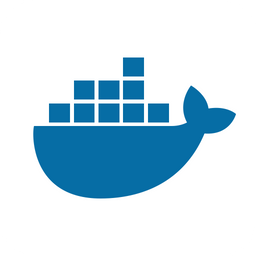

<p align="center"></p>
<p align="center"></p>


&nbsp;&nbsp;&nbsp;&nbsp;&nbsp;&nbsp;&nbsp;&nbsp;&nbsp;&nbsp;&nbsp;&nbsp;&nbsp;&nbsp;&nbsp;&nbsp;&nbsp;&nbsp;&nbsp;

[](https://travis-ci.org/tomp332/Lazy-Wifi)

[](https://github.com/tomp332/Lazy-Wifi/issues)

[](https://opensource.org/licenses/MIT)


# Table of contents
- [Table of contents](#table-of-contents)
- [About The Project](#about-the-project)
- [Installation and Configuration](#installation-and-configuration)
    - [Mailgun](#mailgun)
    - [AWS](#aws)
    - [Lazy-Wifi](#lazy-wifi)
      - [Docker](#docker)
      - [Local](#local)
- [Usage](#usage)
- [Contact](#contact)
- [Disclaimer](#disclaimer)
  
<br><br>

# About The Project

<div>
  
      
  
  
</div>
  <br></br>
  Lazy-Wifi is an automated wifi attack tool that makes your life easier regarding to the entire brute force attack surface.
  This project was built in order to connect the Scanning, Handshake capture and Brute force process of the basic and known faze of wifi attacking.
  <br><br>
  The following happens when running this automation:
  
- Scans for surrounding access points.
- Deauth optional/all clients assosiated to access points.
- Capture handshakes after deauth
- Send handshakes to brute force AWS EC2 instance or any remote machine of your choice
- Send email after finishing cracking password
 
<br><br>
<br><br>

# Installation and Configuration

### Mailgun
- Create a Mailgun account, https://www.mailgun.com
- Get an API key and sandboxed domain (or a domain of your choice).
- Save the key and domain for the next AWS step.
<br><br>

### AWS

- Create an AWS [account](https://aws.amazon.com) and configure an EC2 instance.
- Setup a private key or password for your EC2 SSH connection, you will be needing them for the Lazy-Wifi configuration.
- Upload `remote_automation.py.py` script to remote machine, and configure the following const variables:
```
# Files settings
    _DICTIONARY_FILE = '<Main dictionary file to load for brute force>'
    _PCAP_FILES_DIRECTORY = '<Directory that handshakes are loaded to>'

# Email settings
  _MAILGUN_EMAIL = '<Mailgun account email address>'
  _MAILGUN_API_KEY = '<API key>'
  _MAILGUN_DOMAIN = '<sandbox domain or your domain>'
  _DESTINATION_EMAIL = '<Destination address>'

```
- Give execution permissions to file:
```
chmod +x crack.py
```
- Install pip libraries
```
pip install requests
```

### Lazy-Wifi 

For both types of installations
- Edit configuration file located in lazy_wifi/config/config.ini
```
[BASIC_CONF]

# Main wifi interface to use
interface_name =

[LOGS]

# Log level for application
log_level = INFO

[RECON]

# Time to scan for all networks
recon_scan_time = 30

[ATTACK]

# Number of deauthentication packets to send to each target
num_deauth_packets = 30

# SSID names to target, if blank all targets will be attacked must be list format
# Structure: ['..', '..']
target_ssid_list = []

[HANDSHAKES]

# Time in seconds to scan for handshakes after deauthentication
handshake_scan_time = 35

[REMOTE_CONNECTION]

# SSH hostname
remote_ssh_hostname =

# SSH username
remote_ssh_username =

# SSH password, if a private key was not specified
remote_ssh_password =

# SSH private key, if none leave blank
private_key_path =

# SSH port, default is 22
remote_connection_port =

# Path to upload all pcap files for cracking default is /home/<remote username>/wifi_uploads
remote_upload_dir =

# Path for the remote automation python script, default is /home/<remote username>/remote_automation.py
remote_automation_script_path =

[AWS]

# Specific machine ID in order to get status and interact with it
instance_id =

# AWS EC2 user key id to control service
aws_access_key_id =

# AWS EC2 user api key
aws_secret_access_key =

# AWS EC2 region where the instance is located for example (eu-central-1)
main_region_zone = eu-central-1

# Option to shut down the instance after finishing the attack
shut_down_on_finish = True
```

- Create virtual enviornment:
```
python3 -m venv lazy_venv
```

- Activate the venv:
```
source lazy_venv/bin/activate
```

- Install requirements:
```
pip install -r lazy-wifi/requirements.txt
```
<br><br>


# Usage

Docker option

- This is needed in order to bridge your wifi interface to the docker container:
```
docker run -it --net="host" --privileged lazy-wifi
```

Local option

- As simple as (with virtual python environment activated, run the interpreter with sudo):
```
sudo lazy_venv/bin/python -m lazy_wifi
```
<br><br>

# Contact

Feel free to open issues and contact me with any question :+1:

- :email: Email: [tomp12@protonmail.com](mailto:tomp12@protonmail.com)

- :globe_with_meridians: Twitter: [P@ko](https://twitter.com/tomp332)

- :octocat: Github [P@ko](https://github.com/tomp332)
<br><br>

# Disclaimer

You shall not misuse the information to gain unauthorised access. However you may try out these hacks on your own computer at your own risk. Performing hack attempts (without permission) on computers that you do not own is illegal.

Enjoy :metal:
